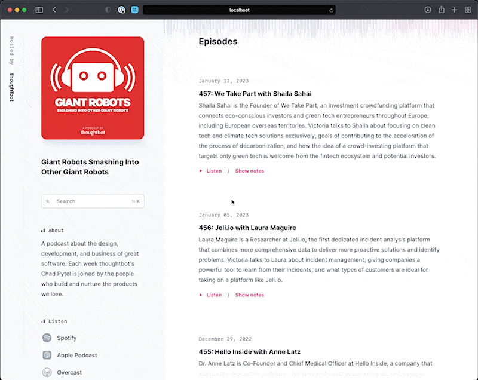

# Lesson 1: Our first lines of JavaScript

We'll ease into the concept of Hotwire by progressively enhancing the
application's Search page navigation with a <kbd><kbd>⌘</kbd>
<kbd>k</kbd></kbd>-powered keyboard shortcut.



First, we re-introduce the `layouts/application.html.erb` template's
call to [javascript_importmap_tags][] to load our application's
[importmap]-backed JavaScript bundle.

```diff
--- a/app/views/layouts/application.html.erb
+++ b/app/views/layouts/application.html.erb
     <%= stylesheet_link_tag "tailwind", "inter-font", "data-turbo-track": "reload" %>

     <%= stylesheet_link_tag "application", "data-turbo-track": "reload" %>
-    <%# javascript_importmap_tags %>
+    <%= javascript_importmap_tags %>
   </head>
```

Then, we add [@github/hotkey][] to `config/importmap.rb`. Since we're using
[Importmap for Rails][] we can run `./bin/importmap pin @github/hotkey`. This
will resolve the package using [JSPM.org][].

```diff
--- a/config/importmap.rb
+++ b/config/importmap.rb
@@ -7,3 +7,4 @@ pin "@hotwired/stimulus-loading", to: "stimulus-loading.js",
preload: true
 pin_all_from "app/javascript/controllers", under: "controllers"
 pin "trix"
 pin "@rails/actiontext", to: "actiontext.js"
+pin "@github/hotkey", to: "https://ga.jspm.io/npm:@github/hotkey@2.0.1/dist/index.js"
```

Next, we'll attach a new `hotkey` controller to the document's `<body>` element.

```diff
--- a/app/views/layouts/application.html.erb
+++ b/app/views/layouts/application.html.erb
-  <body>
+  <body data-controller="hotkey">
     <%= yield %>
   </body>
 </html>
```

We attach the controller to the `body` in an effort to create a large enough
[scope][]. By scoping this controller to the body, we can add the [targets][]
for the controller to any element in the document.

Now we can build the controller.

```js
// app/javascript/controllers/hotkey_controller.js
import { Controller } from '@hotwired/stimulus'
import { install, uninstall } from "@github/hotkey"

export default class extends Controller {
  static targets = ["shortcut"]

  shortcutTargetConnected(target) {
    target.setAttribute("aria-keyshortcuts", target.getAttribute("data-hotkey"))
    install(target)
  }

  shortcutTargetDisconnected(target) {
    target.removeAttribute("aria-keyshortcuts")
    uninstall(target)
  }
}
```

We use [lifecycle callbacks][] to create two methods based on the name of the
[targets][]. The `shortcutTargetConnected` method will be invoked once the
target is connected to the DOM, while the `shortcutTargetDisconnected` method will
be invoked once the target is disconnected from the DOM.

Anytime an element with a `data-hotkey-target="shortcut"` data attribute appears
on the page, this controller will enable that element to be accessed via the
hotkey. Additionally, we add a `aria-keyshortcuts` attribute to the element and
set the value to whatever the `hotkey` attribute is. In this case, that's
"Meta+k". We do this in an effort to expose the existence of the shortcut to
assistive technologies so the presence of the shortcut can be communicated to
its users.

In the style of its Rails-side counterparts, the `hotkey` controller imports and
extends a base level `ApplicationController`. The `ApplicationController` will
start as an empty class, but provides an opportunity to define shared actions,
logic, or utilities.

```js
// app/javascript/controllers/application_controller.js
import { Controller } from "@hotwired/stimulus"

export default class extends Controller {
}
```

Finally, we'll mark the Search navigation with the
`[data-hotkey-target="shortcut"]` attribute, along with the
`[data-hotkey="Meta+k"]` to attach a keyboard listener.

```diff
--- a/app/views/episodes/podcast/_frame.html.erb
+++ b/app/views/episodes/podcast/_frame.html.erb

     <section class="mt-10 lg:mt-12">
       <div class="border border-gray-300 bg-white rounded-md shadow-sm text-slate-500 focus-within:ring">
-        <%= link_to podcast_search_results_path(podcast), class: "outline-none" do %>
+        <%= link_to podcast_search_results_path(podcast), class: "outline-none",
+              data: {hotkey_target: "shortcut", hotkey: "Meta+k"} do %>
           <div class="flex items-center gap-5 px-3 text-start">
             <%= inline_svg_tag "icons/search.svg", class: "h-2.5 w-2.5" %>

             <div class="flex-1 py-1">
               <span class="font-mono text-sm leading-7">Search</span>
             </div>
+
+            <kbd class="inline-flex items-center gap-1 font-mono text-sm leading-7">
+              <abbr title="Command" class="no-underline text-slate-300">⌘</abbr> K
+            </kbd>
           </div>
         <% end %>
       </div>
```

You'll note that we add `[data-hotkey-target="shortcut"]` to an existing
anchor link. The [@github/hotkey][] library works by triggering a focus event on
form fields, or a click event on other elements. In this case, hitting `Meta+k`
will automatically click the link to the search page.

### Check in

To complete this lesson:

- run `./bin/rails test` to verify the tests pass
- press ⌘ k anywhere in the episodes list page to verify the search shortcut works as expected
  note: using `Control` instead of ⌘ should work as well for non-Mac users

When you're ready, move on to the next lesson by running `./ta/start-lesson 2`.

[javascript_importmap_tags]: https://github.com/rails/importmap-rails#preloading-pinned-modules
[importmap]: https://github.com/WICG/import-maps
[@github/hotkey]: https://github.com/github/hotkey
[Importmap for Rails]: https://github.com/rails/importmap-rails
[JSPM.org]: https://jspm.org
[scope]: https://stimulus.hotwired.dev/reference/controllers#scopes
[lifecycle callbacks]: https://stimulus.hotwired.dev/reference/lifecycle-callbacks#methods
[targets]: https://stimulus.hotwired.dev/reference/targets
