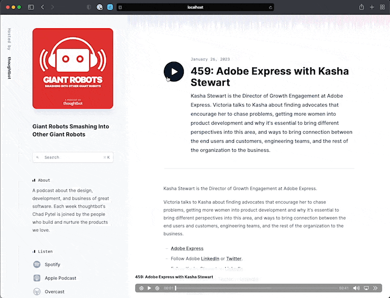
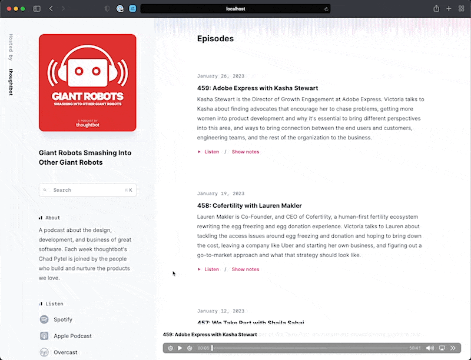

# Lesson 2: The Audio Player

In this lesson we'll make the audio player persist across page visits.
Additionally, we'll make it so the player updates the episode being played when
clicking on a new episode. Finally, we'll couple the player with the multiple
play buttons on the page. When the player is playing, the corresponding "play"
button the page will toggle into a "pause" button.


First, we ensure that the `[id="player"]` element is rendered with
[data-turbo-permanent][] so that the same element instance is preserved as Turbo
Drive navigates the rest of the application. It's important to note that this
element has an `id` (in this case `#player`). This is required in order for
`data-turbo-permanent` to work. This means that as we navigate between pages,
the episode will continue to play.

Next, we change the `[id="audio"]` element nested within the `[id="player"]`
from a `<div>` into a [`<turbo-frame>` element][turbo-frame]. We'll drive that
`<turbo-frame>` with some of our application's `<form>` elements, namely the
ones that submit requests to the `GET /podcasts/:podcast_id/episodes/:id` route.

This means that when a user clicks on the "Listen" button or the
large play button, the fixed audio player at the bottom of the page will load
the episode that was just clicked.

You'll also note that we add `target: "_top"` to the `<turbo-frame>`. Prior to
that change, any `<a>` or `<form>` elements nested within `<div id="audio">`
would drive the entire page. For example, clicking the Podcast title in the
audio player navigates the whole page to the Podcast in question.

Now that those `<a>` and `<form>` elements are nested underneath a
`<turbo-frame>`, their navigations would get "caught" or "trapped", and would
drive the `<turbo-frame>` instead of the page.

```diff
--- a/app/views/episodes/_player.html.erb
+++ b/app/views/episodes/_player.html.erb
-<div id="player" class="fixed inset-x-0 bottom-0 z-10 lg:left-112 xl:left-120">
-  <%= tag.div yield, id: "audio", class: "flex items-center gap-6 bg-white/90 py-4 px-4 shadow shadow-slate-200/80 ring-1 ring-slate-900/5 backdrop-blur-sm md:px-6" %>
+<div id="player" class="fixed inset-x-0 bottom-0 z-10 lg:left-112 xl:left-120" data-turbo-permanent>
+  <%= tag.turbo_frame yield, id: "audio", class: "flex items-center gap-6 bg-white/90 py-4 px-4 shadow shadow-slate-200/80 ring-1 ring-slate-900/5 backdrop-blur-sm md:px-6", target: "_top" %>
 </div>
```

To do this, we'll render those `<form>` elements with the [data-turbo-frame][]
attribute set to `"audio"`. You'll also note that we introduce a [data-action][]
to the `form`, as well as additional `data` attributes to the `<button>`. We'll
discuss those in more detail later.

```diff
--- a/app/views/episodes/_episode.html.erb
+++ b/app/views/episodes/_episode.html.erb
@@ -14,8 +14,15 @@
           <div class="mt-4 flex items-center gap-4">
             <%= tag.form(
               action: podcast_episode_path(episode.podcast, episode),
+              data: {
+                action: "submit->application#preventDefault:reload",
+                turbo_frame: "audio"
+              }
             ) do %>
-              <button class="group flex items-center text-sm font-bold leading-6 text-pink-500 hover:text-pink-700 active:text-pink-900">
+              <button class="group flex items-center text-sm font-bold leading-6 text-pink-500 hover:text-pink-700 active:text-pink-900"
+                      data-controller="play-button"
+                      data-play-button-player-outlet="#<%= dom_id(episode, :audio) %>"
+                      data-action="click->play-button#toggle">
                 <% with_options class: "h-2.5 w-2.5 fill-current" do |styled| %>
                   <div class="block group-aria-pressed:hidden">
                     <span class="sr-only">Play episode <%= episode.title %></span>
```

What this means is that when a user clicks the play button on an episode, it
will update the player to play **that** episode, or it will pause the currently
playing episode.




The same behavior can be achieved on the index of episodes. When a user clicks
the "Listen" button, it will load **that** episode, or it will pause the
currently playing episode.

Again, you'll note we introduce a [data-action][] attribute to the `<form>` as
well as  additional `data` attributes to the `<button>`.

```diff
--- a/app/views/search_results/_search_result.html.erb
+++ b/app/views/search_results/_search_result.html.erb
           </p>
 
           <div class="mt-4 flex items-center gap-4">
-            <form action="<%= url_for(search_result) %>">
-              <button class="group flex items-center text-sm font-bold leading-6 text-pink-500 hover:text-pink-700 active:text-pink-900">
+            <form action="<%= url_for(search_result) %>"
+                  data-action="submit->application#preventDefault:reload"
+                  data-turbo-frame="audio">
+              <button class="group flex items-center text-sm font-bold leading-6 text-pink-500 hover:text-pink-700 active:text-pink-900"
+                      data-controller="play-button"
+                      data-play-button-player-outlet="#<%= dom_id(search_result.episode, :audio) %>"
+                      data-action="click->play-button#toggle">
                 <% with_options class: "h-2.5 w-2.5 fill-current" do |styled| %>
                   <div class="block group-aria-pressed:hidden">
                     <span class="sr-only">Play episode <%= search_result.title %></span>
```



To prevent multiple submissions from re-loading the frame, we'll also introduce
the `application#preventDefault` action with a [custom `:reload` Action
Option][custom-action-option].

```diff
--- a/app/javascript/controllers/application_controller.js
+++ b/app/javascript/controllers/application_controller.js
 import { Controller } from "@hotwired/stimulus"
 
 export default class extends Controller {
+  preventDefault(event) {
+    event.preventDefault()
+  }
 }
```

To grant that controller access to the entire document, we'll render it on the
page's `<html>` element.

```diff
--- a/app/views/layouts/application.html.erb
+++ b/app/views/layouts/application.html.erb
 <!DOCTYPE html>
-<html>
+<html data-controller="application">
   <head>
     <title>Botcasts</title>
     <meta name="viewport" content="width=device-width,initial-scale=1">
```

The `preventDefault` action cancels the `submit` event. When combined with the
`:reload` Action Option, it will only ever be invoked when the [SubmitEvent][]
that's dispatched indicates that the `<form>` submission will drive the document
or a targeted `<turbo-frame>` to an already-loaded URL. If that's the case, the
Action Option will prevent the `submit` event from being dispatched to
`application#preventDefault`.

In short, this just ensures we only load the audio once, even if the play button
is clicked multiple times.

```diff
+++ b/app/javascript/controllers/application.js
+application.registerActionOption("reload", ({ event, value }) => {
+  if (event.type == "submit") {
+    const { submitter, target: form } = event
+    const turboFrame = getTurboFrame(submitter) || getTurboFrame(form)
+    const action = submitter?.getAttribute("formaction") || form.action
+    const url = new URL(action, document.baseURI)
+    const reload = turboFrame ?
+      url.href == new URL(turboFrame.src, turboFrame.baseURI).href :
+      url.href == new URL(location.href).href
+
+    return reload == value
+  } else {
+    return true
+  }
+})
+
+function getTurboFrame(element) {
+  if (element) {
+    return document.getElementById(element.getAttribute("data-turbo-frame"))
+  } else {
+    return null
+  }
+}
+
 export { application }
```

To control an already-loaded `<turbo-frame id="audio">` element that nests an
`<audio>` element, we introduce a `player` controller to manage the `<audio>`
element's state. The `player` controller listens for [loadeddata][] events
dispatched by the `<audio>` element when it's rendered by the `<turbo-frame>`
element, then attempts to auto-play by the `loadeddata` event to the
`player#play` action.

```js
// app/javascript/controllers/player_controller.js
import ApplicationController from "controllers/application_controller"

export default class extends ApplicationController {
  play() {
    this.element.play()
  }

  toggle() {
    if (this.element.paused) this.play()
    else this.element.pause()
  }
}
```

```diff
--- a/app/views/episodes/show.html.erb
+++ b/app/views/episodes/show.html.erb
-      <%= audio_tag @episode.audio, id: dom_id(@episode, :audio), class: "w-full", controls: true %>
+      <%= audio_tag @episode.audio, id: dom_id(@episode, :audio), class: "w-full", controls: true,
+            data: {controller: "player", action: "loadeddata->player#play"} %>
```

This means that when the audio is loaded, it will automatically play. For
example, when we can click the "Listen" button for an episode, not only does it
load that episode in the fixed player at the bottom of the screen, but it will
also automatically play the episode once it's finished loading.

We also add a `play-button` Stimulus controller to drive those state changes.

```js
// app/javascript/controllers/play_button_controller.js
import ApplicationController from "controllers/application_controller"

export default class extends ApplicationController {
  static outlets = ["player"]

  playerOutletConnected(controller, element) {
    element.addEventListener("play", this.#press)
    element.addEventListener("pause", this.#unpress)
    element.addEventListener("ended", this.#unpress)

    element.setAttribute("aria-controls", element.id)

    if (element.paused) this.#unpress()
    else this.#press()
  }

  playerOutletDisconnected(controller, element) {
    element.removeEventListener("play", this.#press)
    element.removeEventListener("pause", this.#unpress)
    element.removeEventListener("ended", this.#unpress)

    element.removeAttribute("aria-controls")
    this.#unpress()
  }

  toggle() {
    for (const playerOutlet of this.playerOutlets) {
      playerOutlet.toggle()
    }
  }

  #press = () => {
    this.element.setAttribute("aria-pressed", true)
  }

  #unpress = () => {
    this.element.setAttribute("aria-pressed", false)
  }
}
```

The `play-button` controller utilizes the concept of an [Outlet][] to maintain
direct access to a `player` Stimulus controller. The Outlet resolves the correct
`<audio>` element based on a CSS selector that targets it by an `[id]` attribute
generated by a call to `dom_id($EPISODE_INSTANCE, :audio)`. What this means is
that we do not need to [scope][] our player inside the various play buttons on
each page. Instead, we can just reference the player with
`data-play-button-player-outlet`.

The `playerOutletConnected()` and `playerOutletDisconnected()` methods are both
[outlet callbacks][] and control what happens when the player is added or
removed from the page.

The `toggle()` method iterates over all the players and will call toggle their
play state. This works because the `playerOutlet` is an instance of a
`player_controller`, which defines a `toggle()` method.

```erb
<%# app/views/episodes/_episode.html.erb %>
data-play-button-player-outlet="#<%= dom_id(episode, :audio) %>"
```

The `play-button` controller synchronizes the `<button>` element's
`[aria-controls]` and `[aria-pressed]` attribute state with any `player`-side
state changes, and routes `click` events to its own `play-button#toggle` action.

### Check in

To complete this lesson:

- run `./bin/rails test` to verify the tests pass
- click on the play buttons in the UI and verify the the audio player is coupled with the multiple
play buttons on the page

When you're ready, move on to the [next lesson](./lesson-3.md).

[data-turbo-permanent]: https://turbo.hotwired.dev/handbook/building#persisting-elements-across-page-loads
[turbo-frame]: https://turbo.hotwired.dev/handbook/frames
[data-turbo-frame]: https://turbo.hotwired.dev/handbook/frames#targeting-navigation-into-or-out-of-a-frame
[custom-action-option]: https://stimulus.hotwired.dev/reference/actions#options
[SubmitEvent]: https://developer.mozilla.org/en-US/docs/Web/API/SubmitEvent
[Outlet]: https://stimulus.hotwired.dev/reference/outlets
[loadeddata]: https://developer.mozilla.org/en-US/docs/Web/API/HTMLMediaElement/loadeddata_event
[scope]: https://stimulus.hotwired.dev/reference/controllers#scopes
[outlet callbacks]: https://stimulus.hotwired.dev/reference/outlets#outlet-callbacks
[data-action]: https://stimulus.hotwired.dev/reference/actions
