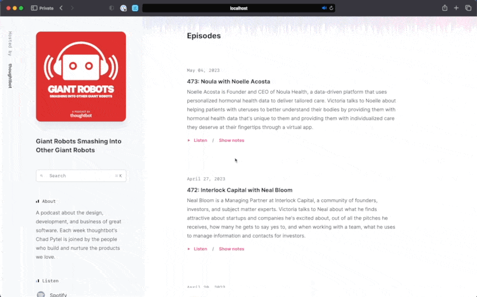

# Lesson 3: Infinite Scroll

In this lesson we'll demonstrate how to progressively enhance our existing
pagination system by seamlessly replacing it with an infinite scroll feature.

Additionally, we'll ensure that the page numbers continue to be appended to the
URL as query parameters, preserving essential functionality.



First, we wrap the pagination in a [Turbo Frame][] with an `id`. This will
allow us to replace the pagination links with the next set of paginated links
as the user navigates through the results. Additionally, it's important to add
[`target="_top"`][2] to the links within the `turbo-frame`. This ensures that
clicking on any of the links within the frame will replace the whole page, and
not just the contents of the frame. This is necessary because are links to
episodes within the paginated results.

Next, we need to add a nested `turbo-frame` to load the next set of results. By
adding [`loading: "lazy"`][3], we ensure that the frame won't fire off an event
until it's visible. This helps to improve performance by preventing all results
from being loaded on the first page load. Additionally, we can use
[`data-turbo-action: replace`][4] to update the browser's navigation history.
This means that the query string will be appended to the URL, and clicking the
back button will work as expected.

```diff
--- a/app/views/episodes/index.html.erb
+++ b/app/views/episodes/index.html.erb
@@ -9,9 +9,9 @@
     </div>
 
     <div class="divide-y divide-slate-100 sm:mt-4 lg:mt-8 lg:border-t lg:border-slate-100">
-      <div>
+      <turbo-frame id="page_<%= @page.page %>" target="_top">
         <% if @page.prev %>
-          <div class="py-10 sm:py-12">
+          <div class="py-10 sm:py-12 hidden first:block">
             <div class="lg:px-8">
               <div class="lg:max-w-4xl">
                 <div class="flex justify-center mx-auto px-4 sm:px-6 md:max-w-2xl md:px-4 lg:px-0">
@@ -29,8 +29,9 @@
         <%= render @episodes %>
 
         <% if @page.next %>
-          <div>
-            <div class="py-10 sm:py-12">
+          <%= tag.turbo_frame id: "page_#{@page.next}", src: pagy_url_for(@page, @page.next), loading: "lazy",
+                data: {turbo_action: "replace", controller: "element", action: "turbo:frame-load->element#replaceWithChildren"} do %>
+            <div class="py-10 sm:py-12 hidden last:block">
               <div class="lg:px-8">
                 <div class="lg:max-w-4xl">
                   <div class="flex justify-center mx-auto px-4 sm:px-6 md:max-w-2xl md:px-4 lg:px-0">
@@ -43,9 +44,9 @@
                 </div>
               </div>
             </div>
-          </div>
+          <% end %>
         <% end %>
-      </div>
+      </turbo-frame>
     </div>
   </div>
 <% end %>
```

We introduce a new `element_controller` that will be responsible for replacing
the `turbo-frame` with a new set of results and pagination. By calling
replaceWithChildren(), the controller's element is removed, but its children
remain, effectively "unwrapping" the container element.

```js
// app/javascript/controllers/element_controller.js
import ApplicationController from "controllers/application_controller"

export default class extends ApplicationController {
  replaceWithChildren() {
    this.element.replaceWith(...this.element.children)
  }
}
```

We apply the same structural changes from the episode's index on the search
result's page.

```diff
--- a/app/views/search_results/index.html.erb
+++ b/app/views/search_results/index.html.erb
@@ -51,9 +51,9 @@
     </div>
 
     <div id="search_results_list" class="divide-y divide-slate-100 sm:mt-4 lg:mt-8 lg:border-t lg:border-slate-100">
-      <div>
+      <turbo-frame id="page_<%= @page.page %>" target="_top">
         <% if @page.prev %>
-          <div class="py-10 sm:py-12">
+          <div class="py-10 sm:py-12 hidden first:block">
             <div class="lg:px-8">
               <div class="lg:max-w-4xl">
                 <div class="flex justify-center mx-auto px-4 sm:px-6 md:max-w-2xl md:px-4 lg:px-0">
@@ -73,7 +73,8 @@
         <% end %>
 
         <% if @page.next %>
-          <div>
+          <%= tag.turbo_frame id: "page_#{@page.next}", src: pagy_url_for(@page, @page.next), loading: "lazy",
+                data: {turbo_action: "replace", controller: "element", action: "turbo:frame-load->element#replaceWithChildren"} do %>
             <div class="py-10 sm:py-12">
               <div class="lg:px-8">
                 <div class="lg:max-w-4xl">
@@ -87,9 +88,9 @@
                 </div>
               </div>
             </div>
-          </div>
+          <% end %>
         <% end %>
-      </div>
+      </turbo-frame>
     </div>
   </div>
 <% end %>
```
### Check in

To complete this lesson:

- run `./bin/rails test` to verify the tests pass
- scroll down the episodes and verify that the page numbers continue to be appended to the
URL as query parameters

When you're ready, move on to the [next lesson](./lesson-4.md).

[Turbo Frame]: https://turbo.hotwired.dev/handbook/frames
[2]: https://turbo.hotwired.dev/reference/frames#html-attributes
[3]: https://turbo.hotwired.dev/reference/frames#lazy-loaded-frame
[4]: https://turbo.hotwired.dev/reference/frames#frame-that-promotes-navigations-to-visits
